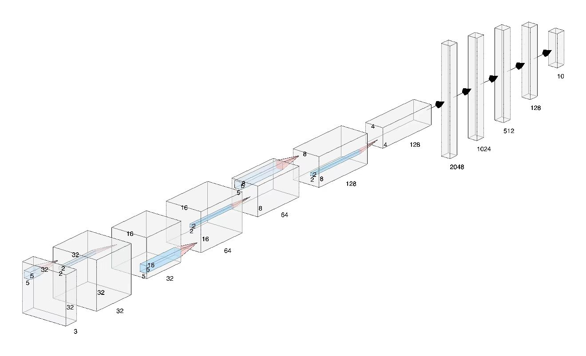
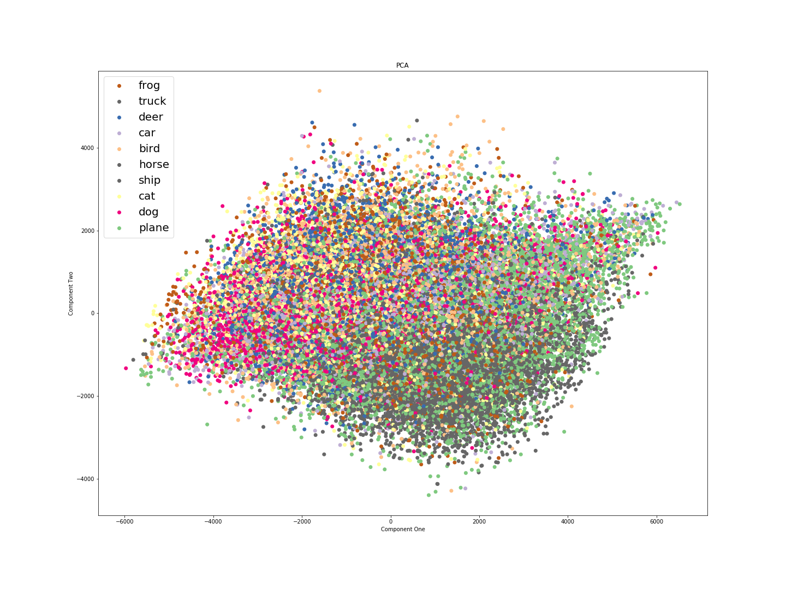
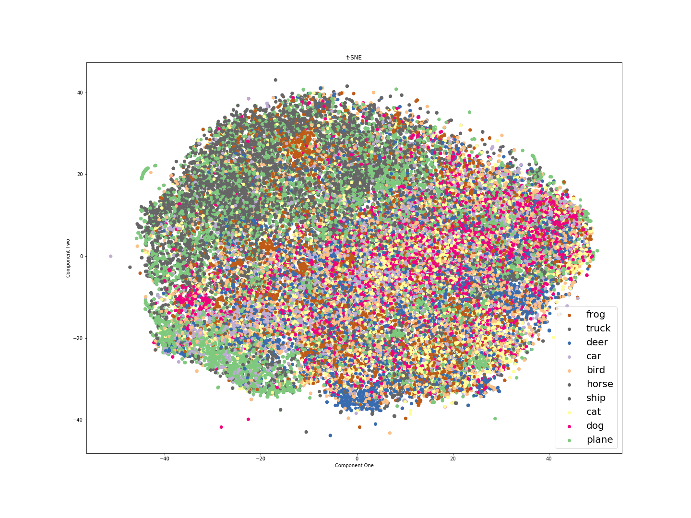

# CNN-CIFAR-10-Image-Classification
Simple CNN for CIFAR-10 image classification task using Pytorch

## Dataset
[CIFAR-10](https://www.cs.toronto.edu/~kriz/cifar.html)

## CNN

### PCA
Reduce to 50 components by scikit-learn PCA, plot first two components.

### t-SNE
Further reduce to two dimension by t-SNE in sklearn.

### Result
92.8% accuracy after 30 epochs.

## Run
- Install [Anaconda](https://www.anaconda.com/)
- Create a conda env that contain python 3.7.5: `conda create -n your_env_name python=3.7.5`
- Activate the environment (do this every time you open a new terminal): `conda activate your_env_name`
- Install the requirements into this conda env: `pip install --user --requirement requirements.txt`
- Run the jupyter notebook: `jupyter notebook`

## Reference
- [Pytorch](https://pytorch.org/docs/stable/nn.html)
- [scikit-learn](https://scikit-learn.org/stable/)
